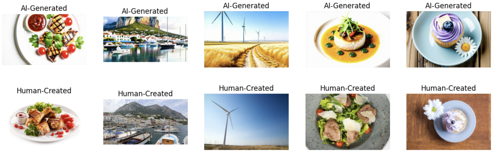
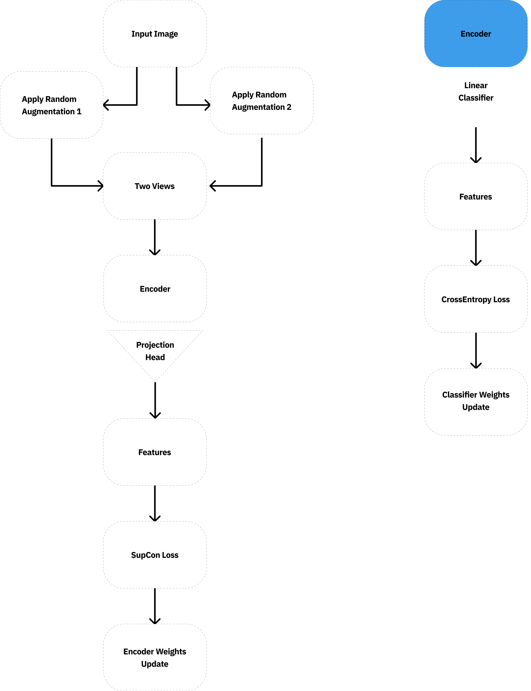

# AI-Image-Detector

## Repository Sturcture
```
AI-Image-Detector/
├── documents/                 # Project paper
├── eda/                       # Exploratory Data Analysis notebooks
├── images/                    # Figures
├── networks/                  # ResNet50, EfficientNetB3 networks
├── resources/                 # addtional resources
├── utils/                     # Utility classes
├── weights/                   # Pre-trained EfficientNetB3 encoder weight
├── .gitignore                 # Git ignore file
├── README.md                  # Project documentation
├── SupCon.py                  # SupCon backbone training script
├── SupConClassifier.py        # Linear Classifier training script using SupCon features
├── losses.py                  # SupCon loss function definition
└── requirements.txt           # Python dependencies
```


## Objective

AI has reached a point where it can generate highly realistic faces, scenes, and objects. This study addresses the problem of distinguishing AI-generated visuals from authentic photographs using a unique dataset, "AI vs. Human-Generated Images," from a Kaggle competition. Unlike conventional datasets, this dataset provides paired images where each real image has a corresponding AI-generated counterpart, allowing for direct comparative analysis. We leverage this structured pairing within a deep learning framework, incorporating convolutional neural networks (CNNs) and transformer-based architectures to develop robust classifiers. In addition, we explore contrastive learning to enhance feature discrimination, hypothesizing that it improves generalization by enforcing a more distinct separation between real and AI-generated images.

## Data Source

The [AI vs. Human-Generated Images](https://www.kaggle.com/datasets/alessandrasala79/ai-vs-human-generated-dataset?select=test_data_v2) dataset is published on Kaggle.

"The dataset consists of authentic images sampled from the Shutterstock platform across various categories, including a balanced selection where one-third of the images feature humans. These authentic images are paired with their equivalents generated using state-of-the-art generative models. This structured pairing enables a direct comparison between real and AI-generated content, providing a robust foundation for developing and evaluating image authenticity detection systems."



## Model Architecture



## Running

### Prerequisites

1. Clone the repository.
2. Create a directory called `dataset`.
3. Download the dataset from the kaggle competition and locate it in `dataset`.
4. Run `pip install -r requirements.txt` to download all dependencies.
5. Setup [Weights & Biases](https://wandb.ai/site/) to track training progress.

### Train Encoder

To train the encoder using supervised contrastive learning, run the training script with your desired model architecture:

```bash
# Train with EfficientNet-B3
python SupCon.py --model efficientnetb3 --pretrained

# Train with Resnet50
python SupCon.py --model efficientnetb3 --pretrained
```

You can also omit `--pretrained` if you prefer training from scratch.

Optional arguments:
- `--model`: Choose between `efficientnetb3` and `resnet50`.
- `--pretrained`: Flag to load pretrained ImageNet weights.

Training progress and loss values are logged via Weights & Biases, if configured.

#### Output

At the end of training:
- The best encoder model (based on training loss) will be saved as `best_supcon_encoder.pth`

**Note**: You can skip the training process by using the pretrained encoder weights for EfficientNet-B3 that are already included in this repository under the `weights/` directory.

### Train Classifier

After training or downloading the encoder, you can train a linear classifier on top of the frozen encoder representations.

```bash
# Train classifier using EfficientNetB3 encoder
python SupConClassifier.py --model efficientnetb3 --ckpt_path weights/best_supcon_encoder.pth

# Train classifier using ResNet50 encoder (you must train the encoder yourself)
python TrainClassifier.py --model resnet50 --ckpt_path weights/best_supcon_encoder.pth
```
#### Uisng trained Encoder

- If you've already trained an encoder (or are using the provided `EfficientNetB3` checkpoint), specify the path using `--ckpt_path`.
- The encoder will be frozen, and only the linear classifier will be trained.
- The best classifier (based on validation accuracy) will be saved as `best_supcon_classifier.pth`

### Evaluation & Submission

After training, the script automatically:
- Evaluates the classifier on the validation set.
- Logs metrics including accuracy, precision, recall, and F1 score.
- Generates a `submission.csv` file in the required format:

```bash
id,label
test1.png,1
test2.png,0
```

This file is ready for submission to the [Kaggle competition](https://www.kaggle.com/competitions/detect-ai-vs-human-generated-images/submissions).


